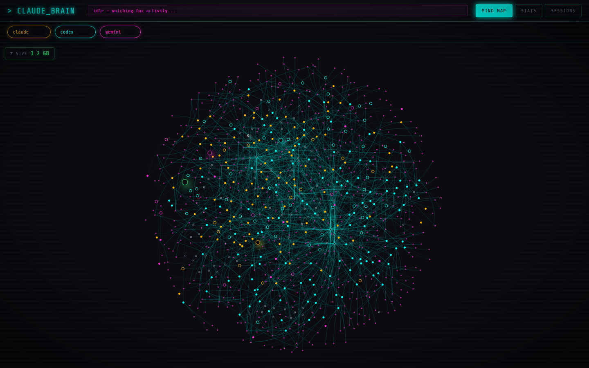
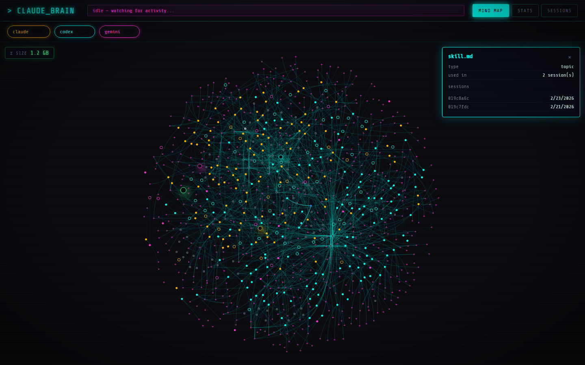
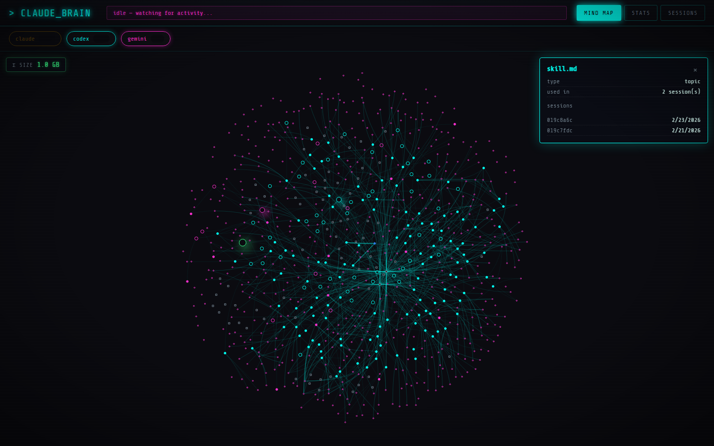
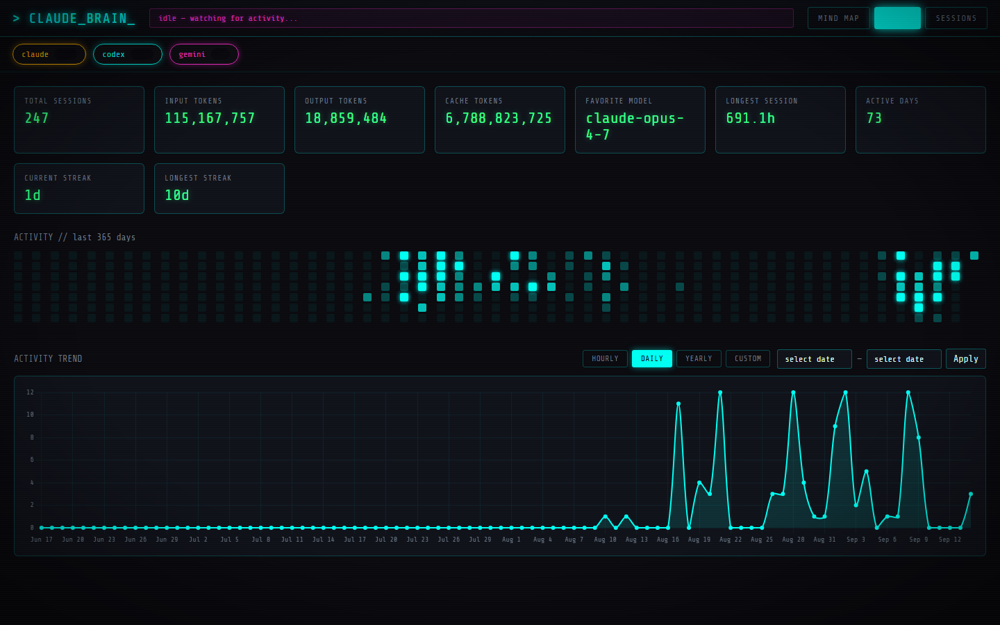
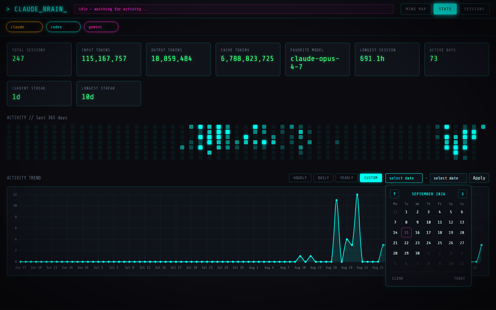
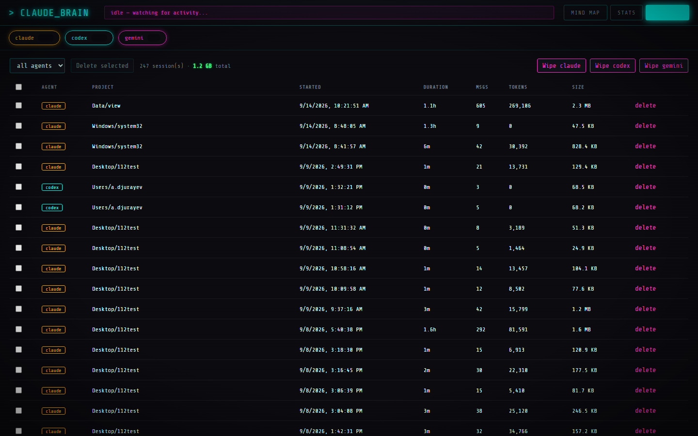
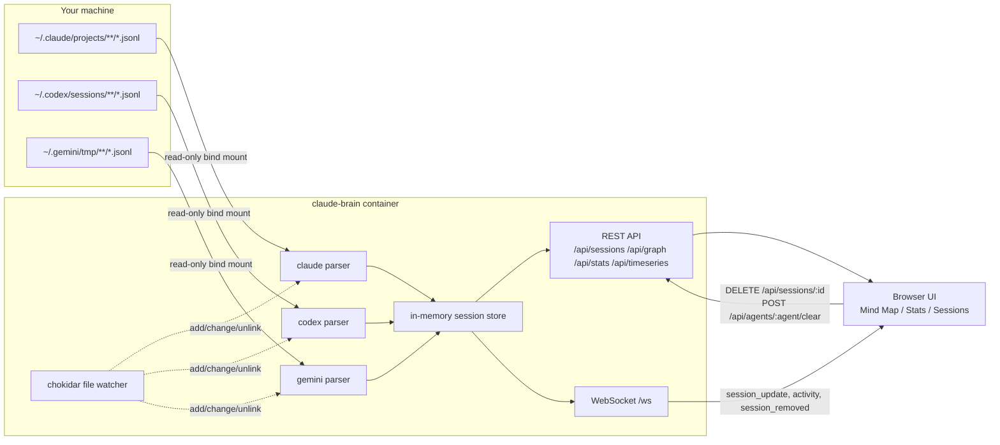

```
  ▄████▄   ██▓    ▄▄▄       █    ██  ▓█████▄ ▓█████       ▄▄▄▄    ██▀███   ▄▄▄       ██▓ ███▄    █
 ▒██▀ ▀█  ▓██▒   ▒████▄     ██  ▓██▒▒██▀ ██▌▓█   ▀      ▓█████▄ ▓██ ▒ ██▒▒████▄    ▓██▒ ██ ▀█   █
 ▒▓█    ▄ ▒██░   ▒██  ▀█▄  ▓██  ▒██░░██   █▌▒███        ▒██▒ ▄██▓██ ░▄█ ▒▒██  ▀█▄  ▒██▒▓██  ▀█ ██▒
 ▒▓▓▄ ▄██▒▒██░   ░██▄▄▄▄██ ▓▓█  ░██░░▓█▄   ▌▒▓█  ▄       ▒██░█▀  ▒██▀▀█▄  ░██▄▄▄▄██ ░██░▓██▒  ▐▌██▒
 ▒ ▓███▀ ░░██████▒▓█   ▓██▒▒▒█████▓ ░▒████▓ ░▒████▒      ░▓█  ▀█▓░██▓ ▒██▒ ▓█   ▓██▒░██░▒██░   ▓██░
 ░ ░▒ ▒  ░░ ▒░▓  ░▒▒   ▓▒█░░▒▓▒ ▒ ▒  ▒▒▓  ▒ ░░ ▒░ ░      ░▒▓███▀▒░ ▒▓ ░▒▓░ ▒▒   ▓▒█░░▓  ░ ▒░   ▒ ▒
   ░  ▒   ░ ░ ▒  ░ ▒   ▒▒ ░░░▒░ ░ ░  ░ ▒  ▒  ░ ░  ░      ▒░▒   ░   ░▒ ░ ▒░  ▒   ▒▒ ░ ▒ ░░ ░░   ░ ▒░
 ░          ░ ░    ░   ▒    ░░░ ░ ░  ░ ░  ░    ░          ░    ░   ░░   ░   ░   ▒    ▒ ░   ░   ░ ░
 ░ ░          ░  ░     ░  ░   ░        ░       ░  ░       ░         ░           ░  ░ ░           ░
 ░                                   ░
```

<div align="center">

[](LICENSE)
[](https://nodejs.org/)
[](docker-compose.yml)
[](backend/server.js)
[](docker-compose.yml)

</div>

## Pitch

Claude Brain is a self-hosted, Docker-packaged dashboard that turns your local **Claude Code**, **Codex CLI**, and **Gemini CLI** session transcripts into an interactive, cyberpunk-themed mind map, a usage-stats view, and a session manager. It's built for anyone who lives in these CLIs and wants to actually *see* what they've been working on — which projects, which tools, how much history has piled up — without sending a single byte to an LLM API. Every byte it shows comes from parsing `.jsonl` files already sitting on your disk.

## Table of Contents

- [Features](#features)
- [Screenshots](#screenshots)
- [Architecture Overview](#architecture-overview)
- [Tech Stack](#tech-stack)
- [Requirements](#requirements)
- [Installation & Quick Start](#installation--quick-start)
- [Configuration](#configuration)
- [Usage Examples](#usage-examples)
- [Project Structure](#project-structure)
- [Security Model](#security-model)
- [Known Limitations](#known-limitations)
- [Contributing](#contributing)
- [License](#license)

## Features

### Mind Map
- Force-directed graph (`vis-network`) of Hub → Agent → Project → Session → Tool/Topic
- Gentle continuous "breathing" physics — never freezes, never lets nodes collide/overlap
- Click any node (not just sessions) to open a full detail panel on the right, showing that node's connected sessions
- Live sessions (transcript touched within the last 5 minutes) glow white with a slow sine-wave pulse
- Per-agent filter chips (Claude/Codex/Gemini) with live session-count badges, toggle to show/hide instantly
- A live "Σ SIZE" readout of total transcript size for whatever's currently visible

### Stats
- Total sessions, input/output/cache token totals, favorite model, longest session, current/longest streak
- GitHub-style 365-day activity heatmap
- Activity trend line chart with Hourly / Daily / Yearly / Custom-range period filters
- Custom range picker is a fully themed calendar (not the native browser date input)

### Session Manager
- Filterable table of every parsed session (agent, project, start time, duration, messages, tokens, file size on disk)
- Multi-select + bulk delete (removes the transcript file from disk, irreversible, confirmation required)
- Per-agent "Wipe" danger-zone action that requires typing the agent's name in caps to confirm

### Live Feed
- WebSocket-driven ticker showing which agent is actively writing to a transcript right now
- A file watcher (`chokidar`) scoped to just the session-transcript subtrees — not your whole `~/.claude`/`~/.codex`/`~/.gemini`

### Persistence & Resilience
- The active tab survives a page reload (stored in `localStorage`)
- Chart.js and vis-network are bundled npm dependencies served by the app itself — no CDN dependency, works fully offline

## Screenshots

### 🧠 Mind Map — Overview
Force-directed graph of every parsed session across all three agents, colored by agent (amber = Claude, cyan = Codex, magenta = Gemini).


### 🧠 Mind Map — Node Detail
Clicking any node — here, a `topic` node — opens a detail panel on the right listing every session connected to it.


### 🎛️ Agent Filter Chips
Toggling the "claude" chip off instantly hides every Claude node and edge, and the size readout updates live (1.2 GB → 1.0 GB).


### 📊 Stats Overview
Summary cards, the 365-day activity heatmap, and the activity trend line chart together.


### 📅 Custom Date Range Picker
A fully custom-built calendar (not the native OS date input) for picking a custom range on the activity trend chart.


### 🗂️ Session Manager
Every session across all three agents in one sortable, filterable, bulk-selectable table — with per-row file size and delete.


## Architecture Overview

The backend is a single Node.js/Express process. On startup it walks three read-only bind-mounted directories, parses every session transcript it finds into one common shape, and keeps the result in an in-memory `Map`. A `chokidar` watcher scoped to just the transcript subtrees keeps that map live as you use your CLIs — new lines written to a `.jsonl` file trigger a re-parse of that one file and a WebSocket broadcast. The frontend is a plain HTML/CSS/JS single-page app (no build step, no framework) that polls the REST API and listens on the WebSocket, rendering the mind map with `vis-network` and the trend chart with `Chart.js` — both served locally by the same Express process rather than pulled from a CDN.



## Tech Stack

| Layer | Technology | Why |
|---|---|---|
| Backend runtime | Node.js 20 (Alpine) | Small base image, matches `backend/Dockerfile`'s `node:20-alpine` |
| HTTP server | Express 4 | Serves the REST API and the static frontend from one process |
| Live updates | `ws` (WebSocket) | Pushes session updates and activity pings to the browser without polling |
| File watching | `chokidar` | Cross-platform, debounced file-change detection scoped to transcript dirs only |
| Frontend | Plain HTML/CSS/JS | No build step needed for a single-page local tool |
| Mind map rendering | `vis-network` | Force-directed graph with physics, bundled locally and served by Express |
| Charting | `Chart.js` | Activity trend line chart, bundled locally and served by Express |
| Packaging | Docker + Docker Compose | One command to build and run, read-only bind mounts for the agent data |

## Requirements

- [ ] Docker Engine and Docker Compose v2 (tested with Docker 29 / Compose v5)
- [ ] Node.js 20+ — only needed if you want to run `backend/server.js` outside Docker, or run the screenshot tooling in `scripts/`
- [ ] One or more of: **Claude Code**, **Codex CLI**, or **Gemini CLI** already installed and used at least once, so there's `.jsonl` session data under `~/.claude`, `~/.codex`, or `~/.gemini` to visualize
- [ ] Free disk space roughly equal to your combined agent session history (the app doesn't copy or duplicate it — it reads the mounted files directly — but leave headroom; a heavy CLI user can accumulate 1 GB+ of transcripts)
- [ ] Port `4545` free on `localhost` (configurable, see [Configuration](#configuration))

## Installation & Quick Start

No manual path editing required — the setup script detects which agents you actually have installed and writes `.env` for you, so this works the same way on your machine as anyone else's, regardless of username or OS.

```bash
git clone https://github.com/AxmatovB/Claude-Mind-Map.git
cd Claude-Mind-Map

# Mac/Linux/WSL/Git Bash:
./setup.sh
# Native Windows PowerShell instead:
#   .\setup.ps1

docker compose up -d --build
```

Open **http://localhost:4545**.

The setup script only writes `.env` entries for agents it actually finds (`~/.claude`, `~/.codex`, `~/.gemini`); anything not found is simply left out. `docker-compose.yml` falls back to an empty placeholder directory (`.empty/`) for any variable that isn't set, so the container always starts cleanly whether you have one agent installed or all three — a missing agent just shows `0` sessions for it instead of breaking the build. Re-run the setup script any time (e.g. after installing a new agent) to pick it up.

To stop:

```bash
docker compose down
```

## Configuration

| Variable | Default | Description |
|---|---|---|
| `CLAUDE_HOME_DIR` | *(none, required in `.env`)* | Host path to your `~/.claude` directory; only its `projects/` subfolder is bind-mounted (read-only) into the container |
| `CODEX_HOME_DIR` | *(none, required in `.env`)* | Host path to your `~/.codex` directory; only its `sessions/` subfolder is bind-mounted (read-only) into the container |
| `GEMINI_HOME_DIR` | *(none, required in `.env`)* | Host path to your `~/.gemini` directory; only its `tmp/` subfolder and `projects.json` file are bind-mounted (read-only) into the container |
| `PORT` | `4545` | Port the Express server listens on inside the container (mapped 1:1 in `docker-compose.yml`) |
| `CLAUDE_DIR` | `/data/claude` | In-container path the backend reads Claude sessions from (set by `docker-compose.yml`, rarely needs changing) |
| `CODEX_DIR` | `/data/codex` | In-container path the backend reads Codex sessions from |
| `GEMINI_DIR` | `/data/gemini` | In-container path the backend reads Gemini sessions from |
| `ACTIVE_WINDOW_MS` | `300000` (5 min) | How recently a transcript file must have been touched for its session to be marked "live" in the UI |

## Usage Examples

**Fetch every parsed session as JSON:**
```bash
curl http://localhost:4545/api/sessions
```

**Fetch the mind-map graph (nodes + edges + total size):**
```bash
curl http://localhost:4545/api/graph
```

**Fetch an hourly activity time series for the trend chart:**
```bash
curl "http://localhost:4545/api/timeseries?granularity=hour"
```

**Permanently delete one session's transcript (irreversible):**
```bash
curl -X DELETE "http://localhost:4545/api/sessions/<session_id>?confirm=true"
```

**Wipe all Codex history from disk (irreversible, requires typed confirmation):**
```bash
curl -X POST http://localhost:4545/api/agents/codex/clear \
  -H "Content-Type: application/json" \
  -d '{"confirm_name": "CODEX"}'
```

## Project Structure

```
claude-brain/
├── backend/
│   ├── server.js            # Express app, REST API, WebSocket, file watchers
│   ├── parsers/
│   │   ├── claude.js        # Parses ~/.claude/projects/**/*.jsonl
│   │   ├── codex.js         # Parses ~/.codex/sessions/**/rollout-*.jsonl
│   │   └── gemini.js        # Parses ~/.gemini/tmp/**/chats/session-*.jsonl
│   ├── lib/
│   │   ├── graph.js         # Builds the mind-map node/edge structure
│   │   ├── stats.js         # Aggregate stats + zero-filled time series
│   │   └── keywords.js      # Deterministic word-frequency topic extraction
│   ├── Dockerfile
│   └── package.json
├── frontend/
│   └── public/
│       ├── index.html       # Single-page app shell
│       ├── app.js           # All UI logic (no build step, no framework)
│       └── style.css        # Cyberpunk theme
├── scripts/
│   ├── screenshot.js        # Playwright script used to generate docs/screenshots
│   └── package.json         # Dev-only tooling deps, not shipped in the image
├── docs/
│   └── screenshots/         # README screenshots
├── .empty/                  # Placeholder mount target for agents you don't have installed
├── docker-compose.yml       # One-command orchestration, read-only agent mounts
├── setup.sh                 # Auto-detects installed agents, writes .env (Mac/Linux/WSL/Git Bash)
├── setup.ps1                # Same, for native Windows PowerShell
├── .env.example              # Manual-setup reference (setup.sh/setup.ps1 write .env for you)
└── README.md
```

## Security Model

This app has **no login and no access control** — its entire safety model is "only reachable from this machine," which is enforced at three layers rather than assumed:

- **Docker port binding.** `docker-compose.yml` publishes the port as `127.0.0.1:4545:4545`, not `4545:4545` — the latter would publish on every network interface (`0.0.0.0`), making the dashboard (and its destructive delete/wipe endpoints) reachable by anyone else on the same LAN.
- **Host- and Origin-header guards.** Every HTTP request and every WebSocket upgrade is checked against a loopback allowlist (`localhost` / `127.0.0.1` / `::1`) in `backend/server.js`, and anything mismatched gets `403`/`401`. These are two separate checks for two separate attacks: **Host** blocks DNS rebinding (an attacker-controlled domain resolved to `127.0.0.1` mid-session, so the browser's Host header says "localhost" while the page itself is still on another origin); **Origin** blocks cross-site WebSocket hijacking, where a page on any other site opens `ws://localhost:4545/ws` directly — that connection has a perfectly correct Host header (it really is connecting to localhost) but carries the initiating page's real Origin, which only an explicit Origin check catches. Both checks only reject when the header is *present and mismatched* — a request with no Origin at all (curl, or a non-browser WebSocket client) is allowed, since a real browser can't spoof or omit Origin on a cross-origin request.
- **Narrow bind mounts.** `docker-compose.yml` mounts only `~/.claude/projects`, `~/.codex/sessions`, `~/.gemini/tmp`, and `~/.gemini/projects.json` — not the whole `~/.claude`, `~/.codex`, `~/.gemini` directories. Those full directories contain live credentials (`~/.claude/.credentials.json`, `~/.gemini/oauth_creds.json`, `~/.codex/.sandbox-secrets/`) that this app has no reason to ever touch; mounting only the transcript subpaths means those files never enter the container at all, even read-only.

None of this makes the app safe to expose beyond `localhost` — do not remove the `127.0.0.1` prefix from the port mapping or put this behind a public reverse proxy without adding real authentication first.

## Known Limitations

- **Project-name decoding is lossy.** Claude Code encodes a project's real path into its folder name by replacing path separators (and other characters like `.` and spaces) with `-`; decoding that back to a real path is a best-effort guess, not a guaranteed reversal (see the comment in `backend/parsers/claude.js`).
- **Gemini sessions carry no token counts.** The Gemini CLI transcript format doesn't include usage/token fields, so Gemini sessions always report `0` tokens in stats — this is a data-availability gap, not a bug.
- **"Active" is an mtime heuristic.** A session is marked live if its transcript file was modified in the last 5 minutes (`ACTIVE_WINDOW_MS`) — there's no direct signal from the CLIs themselves that a session is actively in a conversation turn.
- **In-memory only.** There's no database — the session store is rebuilt from disk on every container restart. Deleting a session or wiping an agent deletes the underlying `.jsonl` file permanently; there is no undo, trash, or backup step built in.
- **Single-container, single-instance.** No horizontal scaling, no multi-user support — this is a personal local tool, not a hosted service.

## Contributing

1. Fork the repo
2. Create a branch: `git checkout -b feature/your-idea`
3. Make your changes (`docker compose up -d --build` to test locally)
4. Commit and push: `git push origin feature/your-idea`
5. Open a pull request describing what changed and why

## License

[MIT](LICENSE) — see the `LICENSE` file for the full text.

---
*Built to visualize local AI-agent session history — zero API calls, zero tokens spent.*
